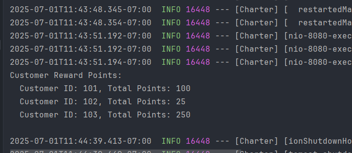
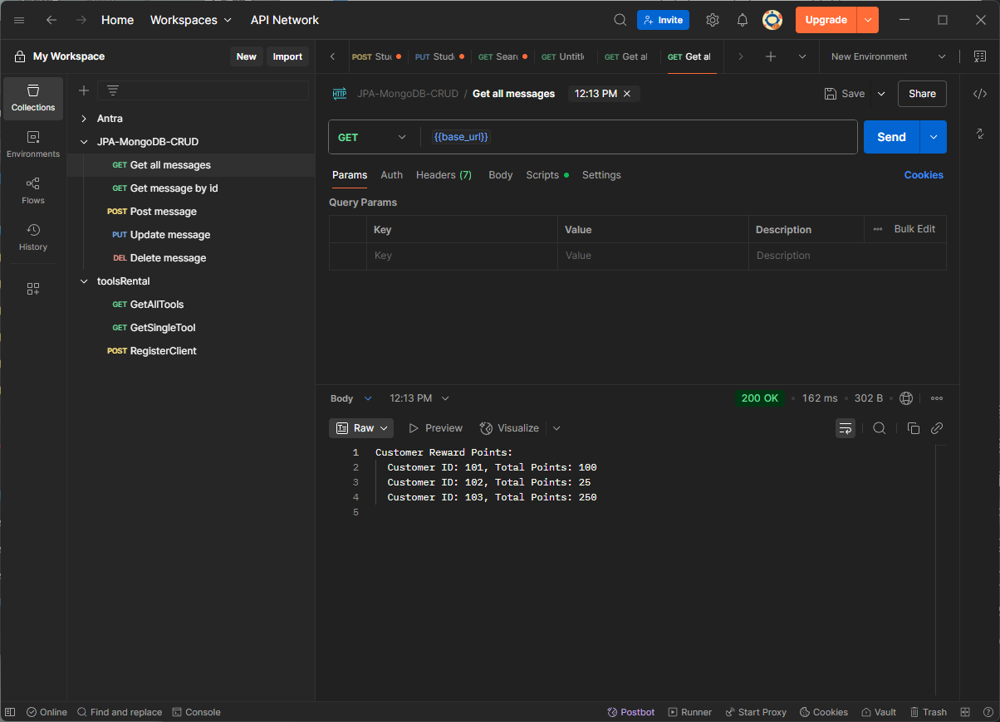

# Getting Started

### Reference Documentation

This application has been tested.

It calculates the points for every customer based on the rules.\
I created a list of transactions in the respository locally without interacting with database\
which is more convenient for you to run and test.\
The logic was written in the service\impl\RetailServiceImpl\

